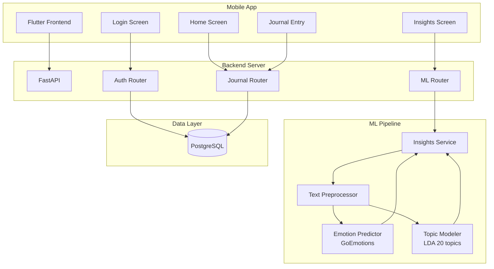
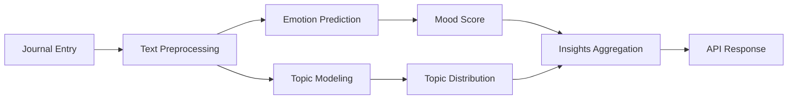
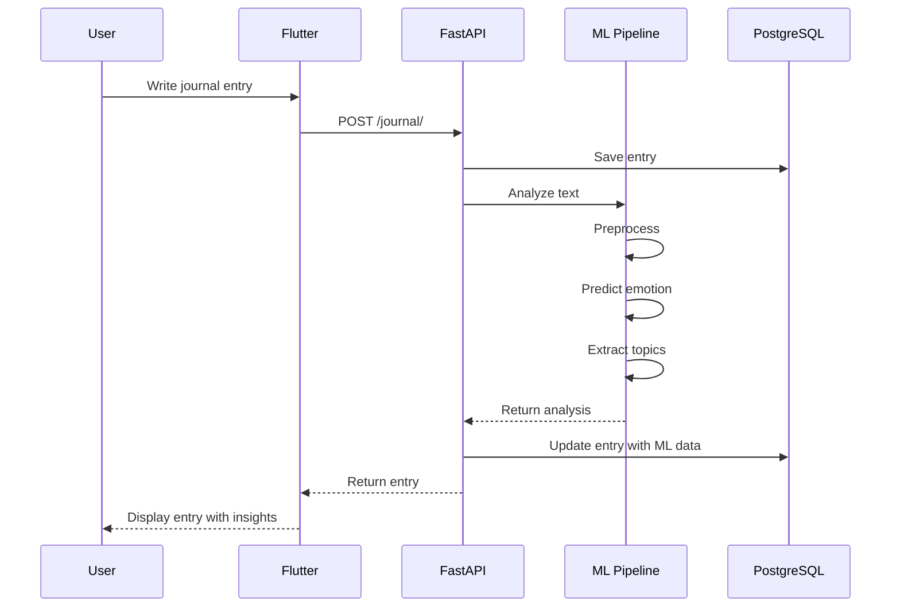
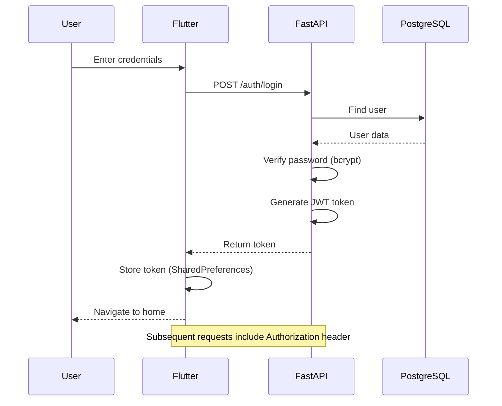
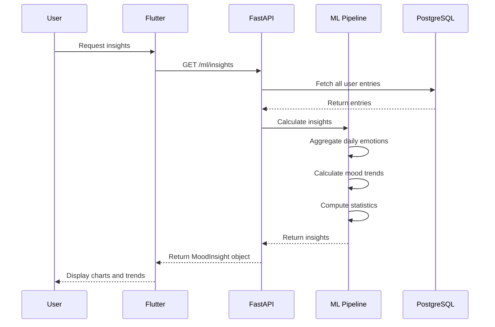
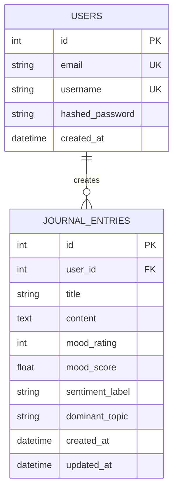
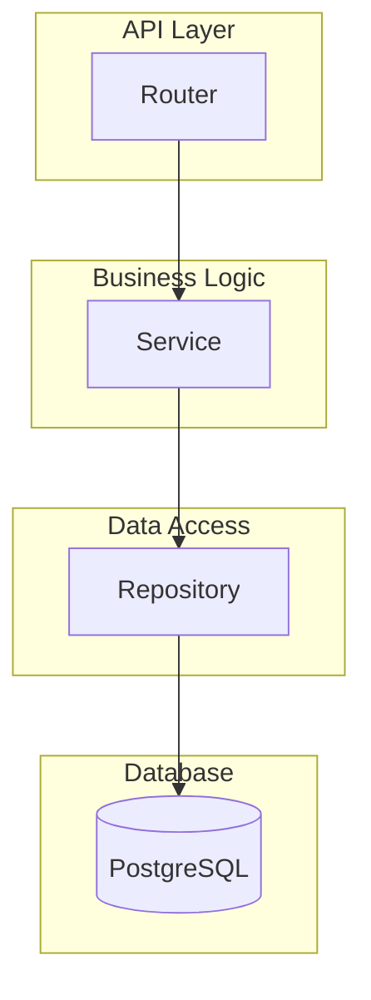
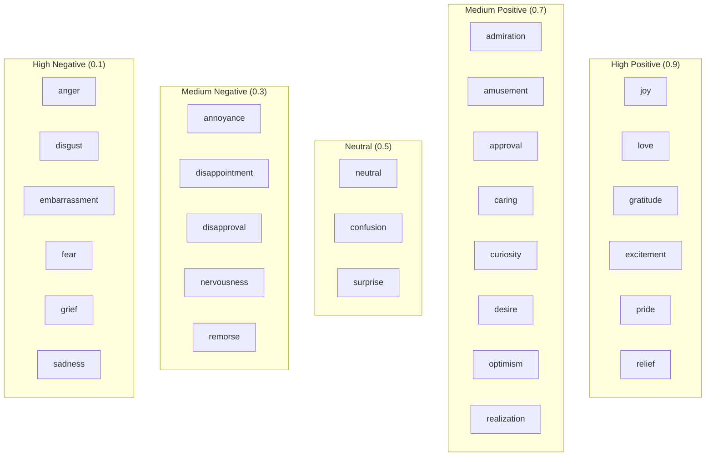
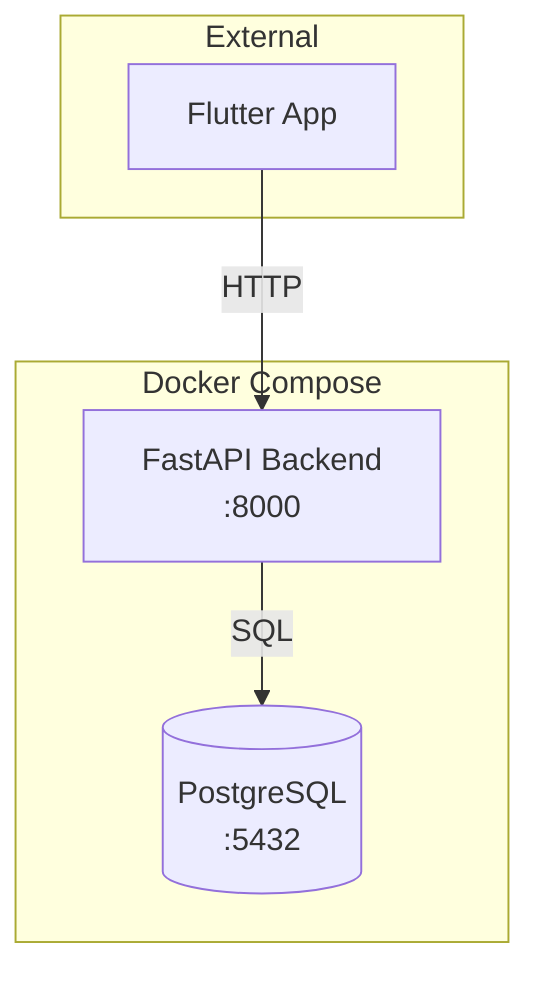

# System Diagrams

## High-Level Architecture

---

## ML Pipeline Flow

---

## Data Flow

---

## Authentication Flow

---

## Mood Insights Flow

---

## Database Schema

---

## Repository Pattern

---

## Emotion Categories

---

## Docker Services

